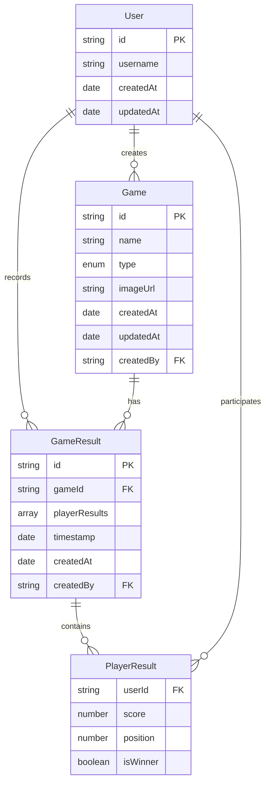
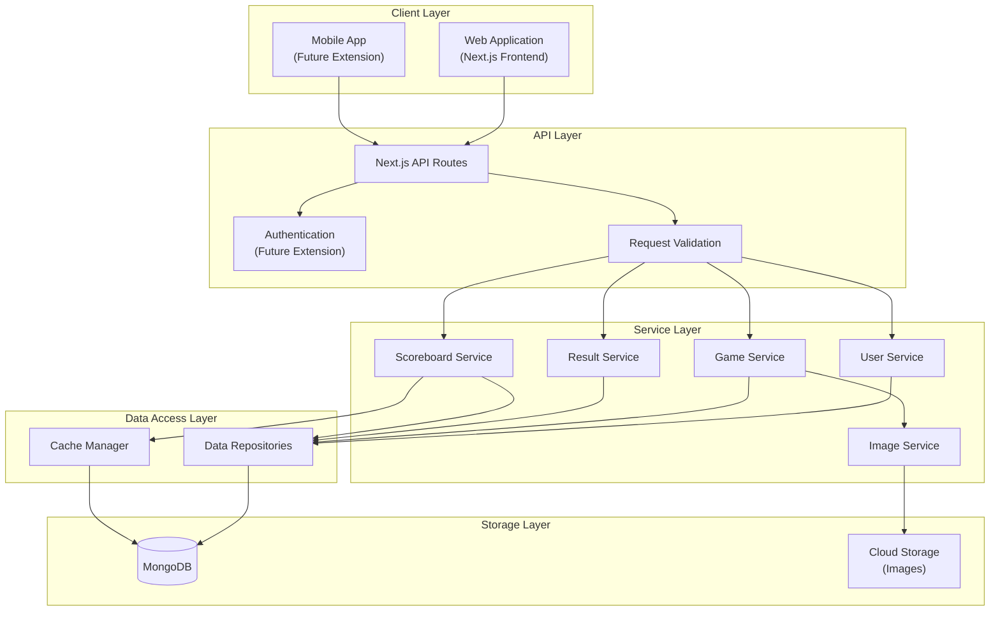
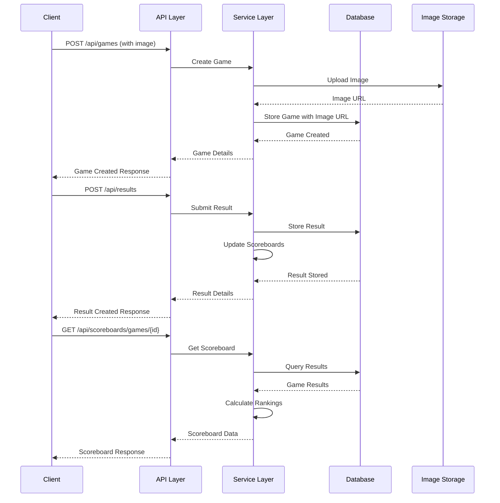
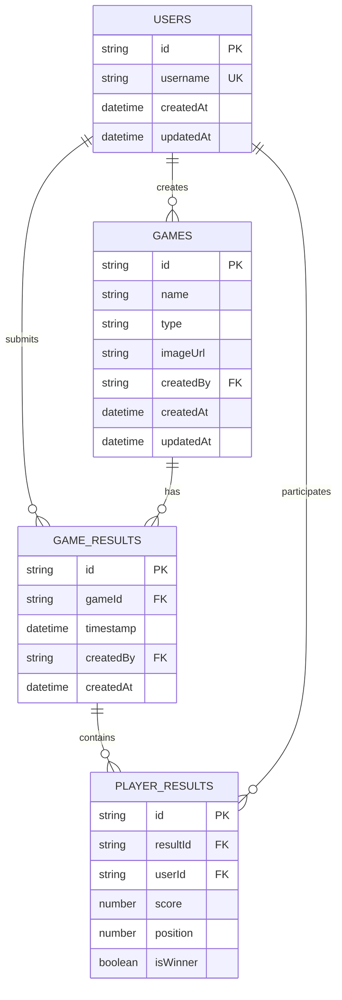

# Game Results Tracking Platform - Architecture Document

## 1. Introduction

This document outlines the architecture for a game results tracking platform that allows users to track game results across different types of games (video games, table games, card games) with scoreboards and player rankings.

### 1.1 Purpose

The purpose of this architecture is to provide a blueprint for implementing a scalable, maintainable, and extensible game results tracking platform that meets the requirements specified in the project requirements document.

### 1.2 Scope

This architecture covers:
- Data models for users, games, and game results
- API endpoints for user management, game management, result submission/retrieval, and scoreboard generation
- Storage strategy for data persistence and image uploads
- System components and their interactions

### 1.3 Assumptions and Constraints

- The system will be implemented using Next.js
- No real authentication is required initially (username only)
- The backend API should be RESTful
- Data must persist between sessions
- The system should support image uploads

## 2. Data Models

### 2.1 User Model

```typescript
interface User {
  id: string;           // Unique identifier
  username: string;     // Display name (unique)
  createdAt: Date;      // When the user was created
  updatedAt: Date;      // When the user was last updated
}
```

**Key considerations:**
- Simple model with just username for MVP
- Designed to be extensible for future authentication integration
- Username must be unique across the system

### 2.2 Game Model

```typescript
interface Game {
  id: string;           // Unique identifier
  name: string;         // Game name
  type: GameType;       // Type of game (enum)
  imageUrl: string;     // URL to the uploaded image
  createdAt: Date;      // When the game was created
  updatedAt: Date;      // When the game was last updated
  createdBy: string;    // Reference to User.id who created the game
}

enum GameType {
  VIDEO_GAME = 'VIDEO_GAME',
  TABLE_GAME = 'TABLE_GAME',
  CARD_GAME = 'CARD_GAME',
  OTHER = 'OTHER'
}
```

**Key considerations:**
- Categorization by game type for better organization and filtering
- Image storage via URL reference
- Tracking who created the game for accountability

### 2.3 Game Result Model

```typescript
interface GameResult {
  id: string;                 // Unique identifier
  gameId: string;             // Reference to Game.id
  playerResults: PlayerResult[]; // Array of player results
  timestamp: Date;            // When the game was played
  createdAt: Date;            // When the result was recorded
  createdBy: string;          // Reference to User.id who recorded the result
}

interface PlayerResult {
  userId: string;             // Reference to User.id
  score: number;              // Numeric score (can be 0 or negative)
  position: number;           // Final position/rank (1 = winner)
  isWinner: boolean;          // Flag for winner(s)
}
```

**Key considerations:**
- Flexible scoring system that works for different game types
- Support for multiple players per game
- Clear winner designation
- Timestamp for when the game was played vs. when the result was recorded

### 2.4 Scoreboard Model (Derived)

```typescript
interface PlayerRanking {
  userId: string;             // Reference to User.id
  username: string;           // Denormalized for convenience
  gamesPlayed: number;        // Total games played
  wins: number;               // Total wins
  winRate: number;            // Calculated win percentage
  totalScore: number;         // Cumulative score (if relevant)
  averagePosition: number;    // Average finishing position
}

interface Scoreboard {
  gameId: string;             // Reference to Game.id (null for overall)
  rankings: PlayerRanking[];  // Sorted array of player rankings
  lastUpdated: Date;          // When the scoreboard was last calculated
}
```

**Key considerations:**
- This is a derived model that can be calculated from GameResults
- Could be materialized for performance or calculated on-demand
- Supports both game-specific and overall rankings

### 2.5 Data Model Relationships



## 3. API Endpoints

### 3.1 User Management Endpoints

#### Create User
- **Method**: POST
- **Path**: `/api/users`
- **Request Body**:
  ```json
  {
    "username": "playerOne"
  }
  ```
- **Response**:
  ```json
  {
    "id": "user123",
    "username": "playerOne",
    "createdAt": "2025-08-21T12:00:00Z",
    "updatedAt": "2025-08-21T12:00:00Z"
  }
  ```
- **Status Codes**:
  - 201: Created successfully
  - 400: Invalid request (e.g., missing username)
  - 409: Username already exists

#### Get User
- **Method**: GET
- **Path**: `/api/users/{userId}`
- **Response**:
  ```json
  {
    "id": "user123",
    "username": "playerOne",
    "createdAt": "2025-08-21T12:00:00Z",
    "updatedAt": "2025-08-21T12:00:00Z"
  }
  ```
- **Status Codes**:
  - 200: Success
  - 404: User not found

#### Update User
- **Method**: PATCH
- **Path**: `/api/users/{userId}`
- **Request Body**:
  ```json
  {
    "username": "newPlayerName"
  }
  ```
- **Response**:
  ```json
  {
    "id": "user123",
    "username": "newPlayerName",
    "createdAt": "2025-08-21T12:00:00Z",
    "updatedAt": "2025-08-21T12:05:00Z"
  }
  ```
- **Status Codes**:
  - 200: Updated successfully
  - 400: Invalid request
  - 404: User not found
  - 409: Username already exists

#### List Users
- **Method**: GET
- **Path**: `/api/users`
- **Query Parameters**:
  - `page`: Page number (default: 1)
  - `limit`: Items per page (default: 20)
  - `search`: Search by username
- **Response**:
  ```json
  {
    "users": [
      {
        "id": "user123",
        "username": "playerOne"
      },
      {
        "id": "user456",
        "username": "playerTwo"
      }
    ],
    "total": 2,
    "page": 1,
    "limit": 20
  }
  ```
- **Status Codes**:
  - 200: Success

### 3.2 Game Management Endpoints

#### Create Game
- **Method**: POST
- **Path**: `/api/games`
- **Request Body**: FormData with:
  - `name`: Game name
  - `type`: Game type (VIDEO_GAME, TABLE_GAME, CARD_GAME, OTHER)
  - `image`: Image file
- **Response**:
  ```json
  {
    "id": "game123",
    "name": "Chess",
    "type": "TABLE_GAME",
    "imageUrl": "/images/games/game123.jpg",
    "createdAt": "2025-08-21T12:10:00Z",
    "updatedAt": "2025-08-21T12:10:00Z",
    "createdBy": "user123"
  }
  ```
- **Status Codes**:
  - 201: Created successfully
  - 400: Invalid request

#### Get Game
- **Method**: GET
- **Path**: `/api/games/{gameId}`
- **Response**:
  ```json
  {
    "id": "game123",
    "name": "Chess",
    "type": "TABLE_GAME",
    "imageUrl": "/images/games/game123.jpg",
    "createdAt": "2025-08-21T12:10:00Z",
    "updatedAt": "2025-08-21T12:10:00Z",
    "createdBy": "user123"
  }
  ```
- **Status Codes**:
  - 200: Success
  - 404: Game not found

#### List Games
- **Method**: GET
- **Path**: `/api/games`
- **Query Parameters**:
  - `page`: Page number (default: 1)
  - `limit`: Items per page (default: 20)
  - `search`: Search by name
  - `type`: Filter by game type
- **Response**:
  ```json
  {
    "games": [
      {
        "id": "game123",
        "name": "Chess",
        "type": "TABLE_GAME",
        "imageUrl": "/images/games/game123.jpg"
      },
      {
        "id": "game456",
        "name": "Poker",
        "type": "CARD_GAME",
        "imageUrl": "/images/games/game456.jpg"
      }
    ],
    "total": 2,
    "page": 1,
    "limit": 20
  }
  ```
- **Status Codes**:
  - 200: Success

### 3.3 Game Result Endpoints

#### Submit Result
- **Method**: POST
- **Path**: `/api/results`
- **Request Body**:
  ```json
  {
    "gameId": "game123",
    "timestamp": "2025-08-21T11:30:00Z",
    "playerResults": [
      {
        "userId": "user123",
        "score": 10,
        "position": 1,
        "isWinner": true
      },
      {
        "userId": "user456",
        "score": 5,
        "position": 2,
        "isWinner": false
      }
    ]
  }
  ```
- **Response**:
  ```json
  {
    "id": "result123",
    "gameId": "game123",
    "timestamp": "2025-08-21T11:30:00Z",
    "playerResults": [
      {
        "userId": "user123",
        "username": "playerOne",
        "score": 10,
        "position": 1,
        "isWinner": true
      },
      {
        "userId": "user456",
        "username": "playerTwo",
        "score": 5,
        "position": 2,
        "isWinner": false
      }
    ],
    "createdAt": "2025-08-21T12:15:00Z",
    "createdBy": "user123"
  }
  ```
- **Status Codes**:
  - 201: Created successfully
  - 400: Invalid request
  - 404: Game or user not found

#### Get Result
- **Method**: GET
- **Path**: `/api/results/{resultId}`
- **Response**:
  ```json
  {
    "id": "result123",
    "gameId": "game123",
    "gameName": "Chess",
    "timestamp": "2025-08-21T11:30:00Z",
    "playerResults": [
      {
        "userId": "user123",
        "username": "playerOne",
        "score": 10,
        "position": 1,
        "isWinner": true
      },
      {
        "userId": "user456",
        "username": "playerTwo",
        "score": 5,
        "position": 2,
        "isWinner": false
      }
    ],
    "createdAt": "2025-08-21T12:15:00Z",
    "createdBy": "user123"
  }
  ```
- **Status Codes**:
  - 200: Success
  - 404: Result not found

#### List Results
- **Method**: GET
- **Path**: `/api/results`
- **Query Parameters**:
  - `page`: Page number (default: 1)
  - `limit`: Items per page (default: 20)
  - `gameId`: Filter by game
  - `userId`: Filter by user participation
  - `startDate`: Filter by date range start
  - `endDate`: Filter by date range end
- **Response**:
  ```json
  {
    "results": [
      {
        "id": "result123",
        "gameId": "game123",
        "gameName": "Chess",
        "timestamp": "2025-08-21T11:30:00Z",
        "playerResults": [
          {
            "userId": "user123",
            "username": "playerOne",
            "score": 10,
            "position": 1,
            "isWinner": true
          },
          {
            "userId": "user456",
            "username": "playerTwo",
            "score": 5,
            "position": 2,
            "isWinner": false
          }
        ]
      }
    ],
    "total": 1,
    "page": 1,
    "limit": 20
  }
  ```
- **Status Codes**:
  - 200: Success

### 3.4 Scoreboard Endpoints

#### Get Game Scoreboard
- **Method**: GET
- **Path**: `/api/scoreboards/games/{gameId}`
- **Query Parameters**:
  - `limit`: Number of top players to include (default: 10)
  - `sortBy`: Ranking criteria (wins, winRate, totalScore) (default: wins)
- **Response**:
  ```json
  {
    "gameId": "game123",
    "gameName": "Chess",
    "rankings": [
      {
        "userId": "user123",
        "username": "playerOne",
        "gamesPlayed": 5,
        "wins": 3,
        "winRate": 0.6,
        "totalScore": 45,
        "averagePosition": 1.4
      },
      {
        "userId": "user456",
        "username": "playerTwo",
        "gamesPlayed": 5,
        "wins": 2,
        "winRate": 0.4,
        "totalScore": 30,
        "averagePosition": 1.6
      }
    ],
    "lastUpdated": "2025-08-21T12:20:00Z"
  }
  ```
- **Status Codes**:
  - 200: Success
  - 404: Game not found

#### Get Overall Scoreboard
- **Method**: GET
- **Path**: `/api/scoreboards/overall`
- **Query Parameters**:
  - `limit`: Number of top players to include (default: 10)
  - `sortBy`: Ranking criteria (wins, winRate, gamesPlayed) (default: wins)
- **Response**:
  ```json
  {
    "rankings": [
      {
        "userId": "user123",
        "username": "playerOne",
        "gamesPlayed": 10,
        "wins": 6,
        "winRate": 0.6,
        "totalGames": 3
      },
      {
        "userId": "user456",
        "username": "playerTwo",
        "gamesPlayed": 10,
        "wins": 4,
        "winRate": 0.4,
        "totalGames": 3
      }
    ],
    "lastUpdated": "2025-08-21T12:20:00Z"
  }
  ```
- **Status Codes**:
  - 200: Success

#### Get User Stats
- **Method**: GET
- **Path**: `/api/scoreboards/users/{userId}`
- **Response**:
  ```json
  {
    "userId": "user123",
    "username": "playerOne",
    "overall": {
      "gamesPlayed": 10,
      "wins": 6,
      "winRate": 0.6,
      "totalGames": 3
    },
    "gameStats": [
      {
        "gameId": "game123",
        "gameName": "Chess",
        "gamesPlayed": 5,
        "wins": 3,
        "winRate": 0.6,
        "totalScore": 45,
        "bestPosition": 1
      },
      {
        "gameId": "game456",
        "gameName": "Poker",
        "gamesPlayed": 5,
        "wins": 3,
        "winRate": 0.6,
        "totalScore": 100,
        "bestPosition": 1
      }
    ]
  }
  ```
- **Status Codes**:
  - 200: Success
  - 404: User not found

## 4. Storage Strategy

### 4.1 Data Persistence Strategy

#### Database Selection

**Recommendation: MongoDB (Document Database)**

**Rationale:**
- Our data models (Users, Games, Game Results) have a document-oriented structure
- Flexible schema allows for easy evolution of data models
- Good performance for read-heavy operations (like scoreboard generation)
- Native JSON support aligns well with our API design
- Excellent integration with Next.js through libraries like Mongoose or MongoDB Atlas

**Alternative Options:**
- **PostgreSQL**: If relational integrity is a priority
- **Firebase Firestore**: For a fully managed, serverless option

#### Data Access Layer

Implement a repository pattern to abstract database operations:

```typescript
// Example repository interface
interface UserRepository {
  create(user: UserInput): Promise<User>;
  findById(id: string): Promise<User | null>;
  findByUsername(username: string): Promise<User | null>;
  update(id: string, data: Partial<UserInput>): Promise<User>;
  list(options: ListOptions): Promise<PaginatedResult<User>>;
}
```

This approach:
- Decouples business logic from data access
- Makes testing easier through mocking
- Allows for future database migrations with minimal code changes

#### Caching Strategy

For frequently accessed data like scoreboards:

- Implement in-memory caching for scoreboard calculations
- Use stale-while-revalidate pattern for API responses
- Consider Redis for distributed caching if scaling horizontally

#### Data Backup and Recovery

- Regular automated backups
- Point-in-time recovery capability
- Retention policy based on data importance

### 4.2 Image Upload and Storage Strategy

#### Storage Options

**Recommendation: Cloud Storage (e.g., AWS S3, Google Cloud Storage)**

**Rationale:**
- Scalable and reliable
- Cost-effective for image storage
- Built-in CDN capabilities for fast delivery
- Handles backup and redundancy automatically

**Alternative Options:**
- **Local File System**: For simpler deployments, but less scalable
- **Database Storage**: Not recommended for images due to performance impact

#### Image Processing Pipeline

1. **Client-side validation**:
   - File type restrictions (JPEG, PNG, WebP)
   - Size limitations (e.g., max 2MB)
   - Dimension constraints

2. **Server-side processing**:
   - Secondary validation for security
   - Image optimization (compression, resizing)
   - Metadata stripping

3. **Storage workflow**:
   ```
   Client -> API Endpoint -> Validation -> Processing -> Upload to Storage -> Save URL to Database
   ```

#### Image Serving Strategy

- Generate unique, non-guessable filenames
- Serve images through CDN for performance
- Implement cache headers for optimal browser caching
- Consider responsive images for different device sizes

## 5. Architecture Diagrams

### 5.1 System Architecture Overview



### 5.2 Data Flow Diagram



### 5.3 Database Schema Diagram



## 6. Implementation Considerations

### 6.1 Technology Stack

- **Frontend**: Next.js with React and TypeScript
- **Styling**: TailwindCSS
- **API**: Next.js API Routes
- **Database**: MongoDB
- **Image Storage**: Cloud Storage (AWS S3 or similar)
- **Testing**: Jest for unit and integration tests

### 6.2 Development Approach

1. **Phase 1: MVP Implementation**
   - User creation with username
   - Create a game with image upload
   - Submit game results
   - View a basic scoreboard
   - Browse existing games

2. **Phase 2: Enhancements**
   - Improved UI/UX
   - Advanced filtering and search
   - More detailed statistics
   - Performance optimizations

3. **Phase 3: Advanced Features**
   - Authentication and authorization
   - Tournament/league management
   - Social features
   - Mobile app integration

### 6.3 Security Considerations

- Input validation for all user-provided data
- Sanitization of user inputs to prevent XSS attacks
- Rate limiting for API endpoints
- Secure image upload process
- Preparation for future authentication integration

### 6.4 Scalability Considerations

- Database indexing for common queries
- Caching strategy for frequently accessed data
- Horizontal scaling capability
- CDN for image delivery
- Optimized API responses

### 6.5 Monitoring and Maintenance

- Error logging and monitoring
- Performance metrics collection
- Regular database backups
- Periodic code reviews and updates

## 7. Conclusion

This architecture document provides a comprehensive blueprint for implementing the game results tracking platform. It covers data models, API endpoints, storage strategy, and system components, with considerations for security, scalability, and future enhancements.

The design prioritizes:
- Simplicity for the MVP
- Extensibility for future features
- Scalability for growing usage
- Maintainability for long-term development

By following this architecture, the development team can implement a robust platform that meets the current requirements while being prepared for future growth and enhancements.